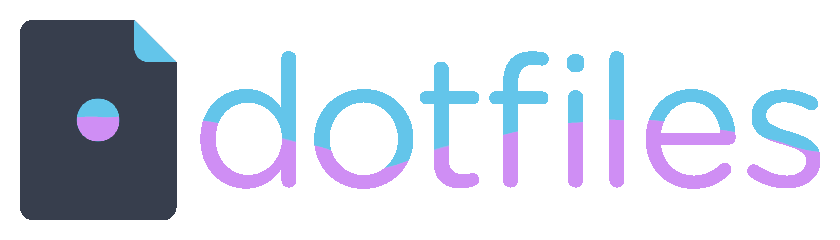

<p align="center"> 
  <a name="top" href="https://github.com/thepanzini/dotfiles">
    
  </a>
</p>

<p align="center">


</p>

## <p align="center">thepanzini's .config files (dotfiles) for Linux (Ubuntu) and Fish. </p>

This is my personal collection of configuration files and scripts. More details below.

## Get Fish
Friendly Interactive Shell [fish](https://github.com/fish-shell/fish-shell)

## Get Oh My Fish
Oh My Fish [OMF](https://github.com/oh-my-fish/oh-my-fish)

## Install Bobthefish
```bash
omf install bobthefish
```

# Copy over files

Clone project.
Move to config file dir at `project_dir(dotfiles)/files`

Then:
```bash
cp -rf .vim ~ && cp -f .vimrc .tmux.conf .tmux.conf.local ~ && cp config.fish ~/.config/fish/
```

#Done!

## License

Licensed under the MIT - see the [LICENSE](LICENSE.md) for details.
